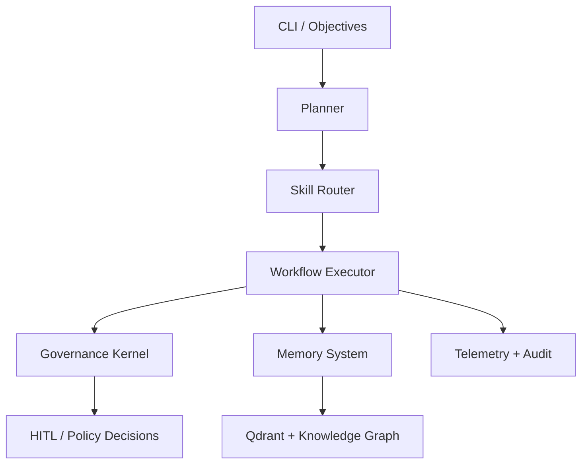

# AI OS Architecture Diagrams

## Control Plane (Mermaid)

```mermaid
graph TD
  A[CLI / Objectives] --> B[Planner]
  B --> C[Skill Router]
  C --> D[Workflow Executor]
  D --> E[Governance Kernel]
  D --> F[Memory System]
  F --> G[Qdrant + Knowledge Graph]
  E --> H[HITL / Policy Decisions]
  D --> I[Telemetry + Audit]
```
