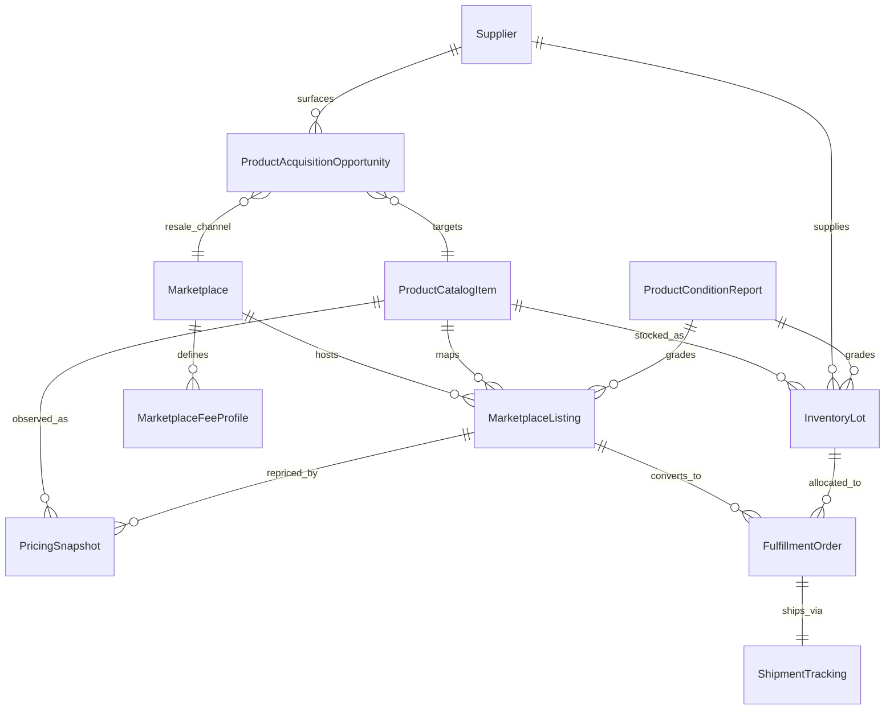

# Ecommerce Ontology (Canonical)

This ontology defines canonical commerce entities for multi-marketplace arbitrage, sourcing, listing, pricing, inventory, and fulfillment.

## Canonical IDs and Normalized Keys

- **`id`**: Canonical per-entity primary key (`mkp_`, `lst_`, `sup_`, `pci_`, `lot_`, `ful_`, `shp_`, `prc_`, `fee_`, `cnd_`, `acq_`).
- **`canonical_keys.global_id`**: Stable global join key across systems.
- **`canonical_keys.channel_id`**: Channel scoped key (e.g., marketplace + seller account).
- **`canonical_keys.external_ids[]`**: Source-native IDs (`system`, `id`) for lineage and reconciliation.
- **Product identity keys**: `sku`, `asin`, `upc`, `ean`, `isbn`, `mpn`.

## Entity Definitions

1. **Marketplace**: sales channel metadata and default economics context.
2. **MarketplaceListing**: sell-side offer on a marketplace, linked to catalog + condition + seller.
3. **Supplier**: source-side counterparty for acquisition opportunities and inventory lots.
4. **ProductCatalogItem**: normalized product identity/spec shell used to map equivalent offers.
5. **InventoryLot**: owned/reserved stock tranche with cost basis and condition linkage.
6. **FulfillmentOrder**: post-sale execution unit linking listing, lot, and shipment.
7. **ShipmentTracking**: carrier lifecycle object for logistics status and milestones.
8. **PricingSnapshot**: point-in-time market observation for spread/margin modeling.
9. **MarketplaceFeeProfile**: effective-dated fee coefficients for net proceeds modeling.
10. **ProductConditionReport**: normalized grading record for used/refurbished/collector inventory.
11. **ProductAcquisitionOpportunity**: scored buy-side opportunity with confidence factors and risks.

## Relationship Diagram



## Condition + Acquisition Confidence Model

`ProductConditionReport` includes:
- `grading_scale`: `new|open_box|used|refurbished|collector`
- `grade`: `A+|A|B|C|D|parts_only`
- `cosmetic_score`, `functional_score`, `completeness_score` (0-100)
- `collector_signals[]` (e.g., sealed, first print, serial match)
- refurbishment fields (`refurbisher`, `warranty_days`)

`ProductAcquisitionOpportunity` includes:
- `confidence_score` (0.0-1.0)
- weighted `confidence_factors[]` with positive/negative direction
- `risk_flags[]` for policy/quality/logistics anomalies

## Sample Payloads

```json
{
  "id": "lst_01JQJ5Q0FQ5Q6GX8EM9WZV9W5P",
  "entity_type": "marketplace_listing",
  "version": 1,
  "status": "active",
  "created_at": "2026-05-11T12:30:00Z",
  "updated_at": "2026-05-11T12:30:00Z",
  "source_system": "ebay_ingestor",
  "tenant_id": "tenant_oldfarmtrucks",
  "canonical_keys": {
    "global_id": "prod_vintage_camera_body_x100",
    "channel_id": "ebay:store_4421:item_18372626",
    "sku": "VCAM-X100",
    "external_ids": [{ "system": "ebay", "id": "18372626" }]
  },
  "links": {
    "marketplace_id": "mkp_ebay_us",
    "catalog_item_id": "pci_01JQJ5JFGJ7KZ9BCXJQ9V9AK8T",
    "condition_report_id": "cnd_01JQJ5N5G8X6S3R2CBXQ2B77Y6"
  },
  "asking_price": 279.0,
  "currency": "USD"
}
```

```json
{
  "id": "acq_01JQJ67KQ4SW2H9E1Y2T9S6G3A",
  "entity_type": "product_acquisition_opportunity",
  "version": 1,
  "status": "open",
  "created_at": "2026-05-11T12:45:00Z",
  "updated_at": "2026-05-11T12:45:00Z",
  "source_system": "sourcing_optimizer",
  "tenant_id": "tenant_oldfarmtrucks",
  "canonical_keys": {
    "global_id": "prod_vintage_camera_body_x100",
    "channel_id": "facebook_marketplace:listing_55221",
    "sku": "VCAM-X100",
    "external_ids": [{ "system": "facebook_marketplace", "id": "listing_55221" }]
  },
  "links": {
    "supplier_id": "sup_01JQJ62NX2BBQY8PK0SQM7Z0ZF",
    "catalog_item_id": "pci_01JQJ5JFGJ7KZ9BCXJQ9V9AK8T",
    "target_marketplace_id": "mkp_ebay_us",
    "source_listing_id": "lst_fb_55221"
  },
  "expected_resale_price": 310.0,
  "expected_total_cost": 201.0,
  "expected_margin": 109.0,
  "confidence_score": 0.82,
  "confidence_factors": [
    { "factor": "price_spread_30d", "weight": 0.4, "direction": "positive" },
    { "factor": "seller_reputation", "weight": 0.2, "direction": "positive" },
    { "factor": "unknown_shutter_count", "weight": 0.15, "direction": "negative" }
  ],
  "risk_flags": ["missing_serial_photo"]
}
```
