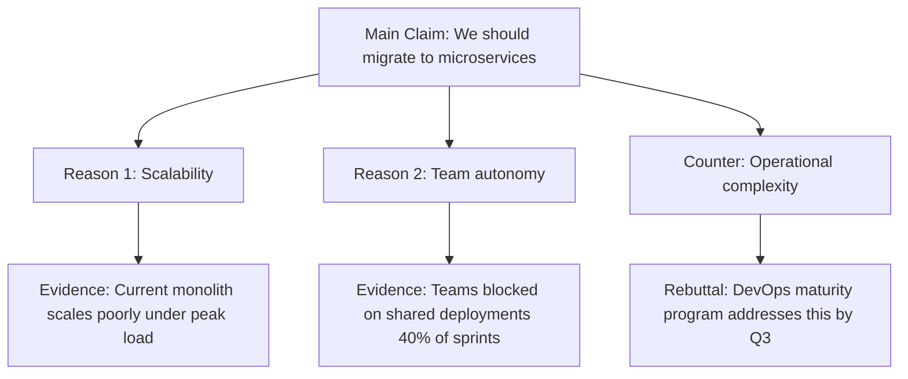
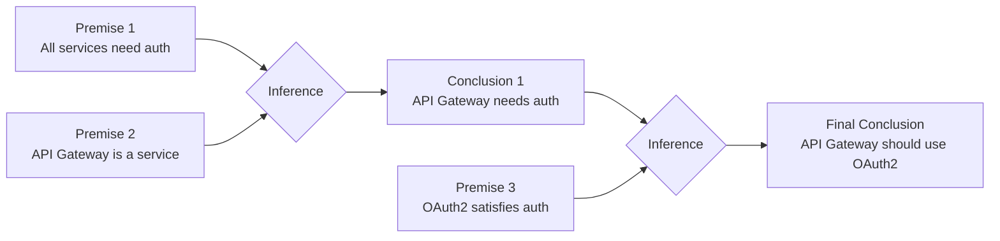
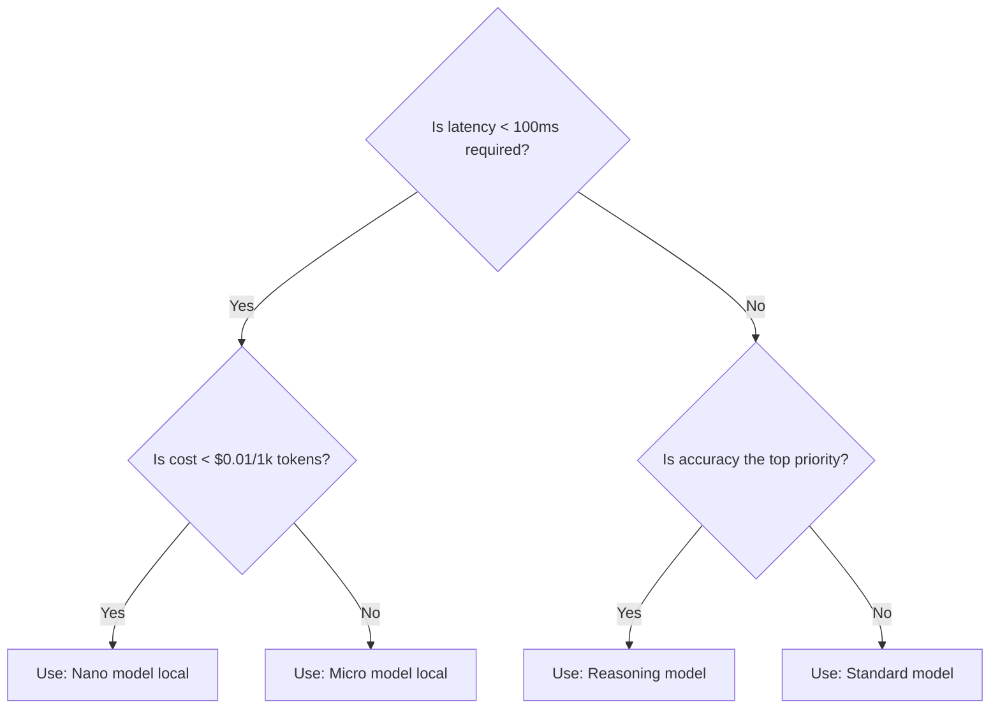
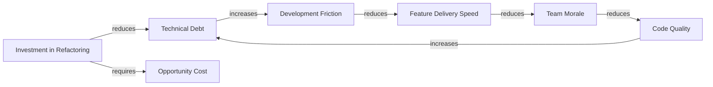

# Reasoning Visualization Formats Reference

## Visualization Type Catalog

### Type 1: Argument Map

**Use for:** Visualizing the structure of an argument, identifying claims and supporting/opposing evidence.



**Mermaid source template:**
```
graph TD
    CLAIM[{main_claim}] --> R1[Reason: {reason_1}]
    CLAIM --> R2[Reason: {reason_2}]
    CLAIM --> C1[Counter: {counter_1}]
    R1 --> E1[Evidence: {evidence_1}]
    C1 --> REB1[Rebuttal: {rebuttal_1}]
```

---

### Type 2: Reasoning Chain (Linear)

**Use for:** Step-by-step deductive or inductive reasoning chains.



**Format rules:**
- Premises: `[]` (rectangle)
- Inference nodes: `{}` (diamond)
- Conclusions: `[]` (rectangle, with `:::conclusion` CSS class)
- Uncertainty: `((` `))` (circle = uncertain step)

---

### Type 3: Decision Tree

**Use for:** Conditional reasoning with branching outcomes.



---

### Type 4: Causal Loop Diagram

**Use for:** Displaying feedback loops and system dynamics reasoning.



**Loop notation:**
- Reinforcing loop (R): arrow labels "increases" → same direction
- Balancing loop (B): arrow labels "reduces" → opposing direction
- Annotate loop type in diagram title

---

### Type 5: Uncertainty Heat Map

**Use for:** Visualizing confidence levels across reasoning steps.

```
Step                          | Confidence | Evidence Quality | Basis
------------------------------|------------|-----------------|-------
Market size estimate          | ████████░░ 80% | Medium | Industry report 2025
TAM capture rate assumption   | ████░░░░░░ 40% | Low | Internal assumption
Revenue per customer          | ██████████ 95% | High | 12-month contract data
Churn rate projection         | ██████░░░░ 60% | Medium | Historical 6-month data
```

**Rendering options:**
- Terminal: Unicode block characters (████)
- Markdown: Bold text + percentage
- HTML: CSS progress bars
- Export: Color-coded table (Green ≥ 80%, Amber 50–79%, Red < 50%)

---

### Type 6: Socratic Dialogue Trace

**Use for:** Showing how a complex question was broken down and answered through sub-questions.

```yaml
socratic_trace:
  main_question: "Should we expand into the European market in 2026?"

  sub_questions:
    - q: "What are the regulatory requirements for EU market entry?"
      answer: "GDPR compliance required; AI Act applies to our product category"
      confidence: HIGH
      source: "legal-team review"

    - q: "What is the estimated market size?"
      answer: "€2.3B TAM; 12% CAGR"
      confidence: MEDIUM
      source: "Gartner 2025 report"

    - q: "Do we have the capacity to support EU customers?"
      answer: "Requires EU data center (estimated 4-month lead time)"
      confidence: HIGH
      source: "infrastructure assessment"

  synthesis: |
    EU expansion is viable by Q4 2026 if data center provisioning begins in Q1.
    Key constraint: GDPR compliance and data residency require 4 months of
    infrastructure work before any customer data can be processed.
```

---

## Format Selection Guide

| Reasoning Type | Recommended Format | Secondary |
|---|---|---|
| Argument evaluation | Argument Map | Socratic Dialogue |
| Step-by-step deduction | Reasoning Chain | — |
| Policy/option selection | Decision Tree | Argument Map |
| System dynamics / feedback | Causal Loop Diagram | — |
| Uncertainty analysis | Uncertainty Heat Map | — |
| Research synthesis | Socratic Dialogue | Argument Map |
| Risk assessment | Decision Tree + Heat Map | — |

---

## Mermaid Rendering Standards

```yaml
mermaid_config:
  theme: "default"
  max_nodes: 30  # Beyond 30 nodes → split into sub-diagrams
  node_text_max_chars: 40  # Truncate node labels at 40 chars
  direction:
    argument_map: "TD"  # Top-down
    reasoning_chain: "LR"  # Left-right
    decision_tree: "TD"
    causal_loop: "LR"

  fallback: |
    If Mermaid rendering is unavailable:
    → Output as indented text outline
    → Use ASCII box-drawing characters for tree structure
```